# Memoria del proyecto Tu Corbata

## 1. Introducción

Tu Corbata es un proyecto académico que simula el desarrollo de una tienda online especializada en la venta de corbatas para un cliente ficticio.

El proyecto incluye el análisis de requisitos, el diseño de la base de datos, su implementación en MySQL y la creación de un prototipo en PHP capaz de consultar las corbatas almacenadas.

## 2. Objetivo general

Diseñar e implementar la base de datos de una tienda online de corbatas y desarrollar un prototipo que permita conectarse a MySQL y consultar los productos almacenados.

## 3. Objetivos específicos

- Analizar las necesidades del cliente.
- Identificar los requisitos funcionales y no funcionales.
- Definir las entidades, atributos y relaciones.
- Crear el modelo entidad-relación.
- Transformar el diseño en un modelo relacional.
- Crear la base de datos TIENDA en MySQL.
- Establecer las claves primarias y foráneas.
- Insertar datos de prueba.
- Conectar PHP con MySQL.
- Realizar una consulta de las corbatas almacenadas.
- Documentar y probar el funcionamiento del proyecto.

## 4. Análisis del enunciado

Tras analizar el caso práctico, se ha determinado que el cliente necesita gestionar los siguientes elementos:

- Usuarios registrados.
- Direcciones de envío.
- Corbatas.
- Tallas.
- Colores.
- Materiales.
- Marcas.
- Pedidos.
- Productos incluidos en cada pedido.

La entrega deberá incluir:

- Explicación de las fases iniciales del proyecto.
- Modelo entidad-relación.
- Modelo relacional.
- Base de datos creada en MySQL.
- Relaciones entre las tablas.
- Capturas de pantalla.
- Código PHP de conexión y consulta.

## 5. Necesidades del cliente

El cliente necesita una tienda online especializada en la venta de corbatas. El sistema deberá permitir almacenar, organizar y consultar la información necesaria para gestionar los productos, los usuarios y los pedidos.

### 5.1 Usuarios del sistema

La aplicación estará dirigida principalmente a clientes que deseen consultar y comprar corbatas. Para ello, será necesario almacenar sus datos personales y las direcciones utilizadas para realizar los envíos.

### 5.2 Gestión de productos

El cliente necesita mantener un catálogo de corbatas. Cada producto deberá disponer, como mínimo, de la siguiente información:

- Nombre.
- Descripción.
- Precio.
- Unidades disponibles.
- Talla.
- Color.
- Material.
- Marca.

La clasificación de las corbatas permitirá organizar el catálogo y facilitar futuras consultas.

### 5.3 Gestión de usuarios y direcciones

El sistema deberá almacenar los usuarios registrados y permitir que cada usuario pueda tener una o varias direcciones de envío.

Los datos personales deberán estar relacionados correctamente con las direcciones y los pedidos realizados.

### 5.4 Gestión de pedidos

La aplicación deberá registrar los pedidos realizados por los usuarios.

Cada pedido deberá incluir:

- El usuario que lo realiza.
- La dirección de envío.
- La fecha del pedido.
- El estado del pedido.
- Las corbatas incluidas.
- La cantidad de cada producto.
- El precio correspondiente.

### 5.5 Consulta de productos

Como parte del prototipo solicitado, deberá desarrollarse una conexión entre PHP y MySQL que permita recuperar y mostrar la información de las corbatas almacenadas en la base de datos.

### 5.6 Alcance inicial

La primera versión del proyecto se centrará en:

- El análisis de requisitos.
- El diseño del modelo entidad-relación.
- La creación del modelo relacional.
- La implementación de la base de datos en MySQL.
- La creación de las relaciones entre tablas.
- La inserción de datos de prueba.
- La conexión desde PHP.
- La consulta y visualización de las corbatas.

No se implementarán inicialmente funciones avanzadas como pagos online, facturación, gestión de devoluciones o autenticación completa.

## 6. Requisitos funcionales

Los requisitos funcionales describen las acciones que deberá permitir realizar el sistema.

### RF-01. Registrar usuarios

El sistema deberá permitir almacenar usuarios registrados con sus datos personales básicos.

Como mínimo, se almacenarán:

- Nombre.
- Apellidos.
- Correo electrónico.
- Contraseña.
- Fecha de registro.

### RF-02. Consultar usuarios

El sistema deberá permitir consultar la información de los usuarios almacenados en la base de datos.

### RF-03. Gestionar direcciones de envío

El sistema deberá permitir registrar una o varias direcciones de envío asociadas a cada usuario.

Cada dirección podrá incluir:

- Calle.
- Número.
- Código postal.
- Localidad.
- Provincia.
- País.

### RF-04. Registrar corbatas

El sistema deberá permitir almacenar las corbatas disponibles en la tienda.

Cada corbata deberá contener, como mínimo:

- Nombre.
- Descripción.
- Precio.
- Stock.
- Talla.
- Color.
- Material.
- Marca.

### RF-05. Clasificar las corbatas

El sistema deberá permitir clasificar las corbatas según:

- Talla.
- Color.
- Material.
- Marca.

### RF-06. Consultar el catálogo de corbatas

El sistema deberá permitir recuperar y mostrar las corbatas almacenadas en la base de datos.

La consulta deberá mostrar, como mínimo:

- Nombre.
- Precio.
- Stock.
- Talla.
- Color.
- Material.
- Marca.

### RF-07. Registrar pedidos

El sistema deberá permitir registrar los pedidos realizados por los usuarios.

Cada pedido deberá estar asociado a:

- Un usuario.
- Una dirección de envío.
- Una fecha.
- Un estado.
- Un importe total.

### RF-08. Añadir corbatas a un pedido

El sistema deberá permitir asociar una o varias corbatas a un pedido.

Para cada producto incluido se almacenará:

- La corbata seleccionada.
- La cantidad.
- El precio unitario en el momento de la compra.
- El subtotal.

### RF-09. Consultar los pedidos

El sistema deberá permitir consultar los pedidos registrados y los productos incluidos en cada uno.

### RF-10. Controlar el estado del pedido

El sistema deberá almacenar el estado de cada pedido.

Los estados iniciales podrán ser:

- Pendiente.
- Pagado.
- En preparación.
- Enviado.
- Entregado.
- Cancelado.

### RF-11. Gestionar el stock

El sistema deberá almacenar la cantidad disponible de cada corbata.

El stock permitirá saber si un producto está disponible para su venta.

### RF-12. Conectar la aplicación con MySQL

El prototipo desarrollado en PHP deberá conectarse a la base de datos TIENDA mediante las credenciales configuradas en el entorno.

### RF-13. Mostrar las corbatas desde PHP

La aplicación deberá ejecutar una consulta SQL desde PHP y mostrar en una página web la información de las corbatas almacenadas.

## 7. Requisitos no funcionales

### RNF-01. Usabilidad

La interfaz deberá ser sencilla, clara y fácil de utilizar.

### RNF-02. Compatibilidad

La aplicación deberá poder ejecutarse en un navegador web moderno.

### RNF-03. Seguridad

Las credenciales de acceso a la base de datos no deberán almacenarse directamente en el código fuente.

Se utilizará un archivo `.env`, que quedará excluido del repositorio mediante `.gitignore`.

### RNF-04. Integridad de los datos

La base de datos deberá utilizar claves primarias y foráneas para mantener correctamente las relaciones entre las tablas.

### RNF-05. Rendimiento

Las consultas básicas deberán ejecutarse en un tiempo razonable para el volumen de datos utilizado en el prototipo.

### RNF-06. Mantenibilidad

El código deberá estar organizado, documentado y separado por responsabilidades para facilitar futuras modificaciones.

### RNF-07. Portabilidad

El proyecto deberá poder ejecutarse en distintos equipos mediante Docker, evitando depender de una instalación local concreta.

### RNF-08. Control de versiones

El código fuente y la documentación se gestionarán mediante Git y GitHub.

### RNF-09. Disponibilidad del entorno

Los servicios de PHP y MySQL deberán iniciarse mediante `docker-compose.yml`.

### RNF-10. Protección de contraseñas

En una futura versión completa, las contraseñas de los usuarios deberán almacenarse cifradas mediante un algoritmo seguro de hash.

## 8. Entidades y atributos

A partir de las necesidades y los requisitos identificados, se han definido las siguientes entidades para la base de datos de Tu Corbata.

### 8.1 Usuario

Representa a los clientes registrados en la tienda.

Atributos:

- `id_usuario`: identificador único del usuario.
- `nombre`: nombre del usuario.
- `apellidos`: apellidos del usuario.
- `email`: correo electrónico.
- `password`: contraseña almacenada de forma segura.
- `telefono`: número de teléfono.
- `fecha_registro`: fecha de creación de la cuenta.
- `activo`: indica si el usuario se encuentra activo.

### 8.2 Dirección

Representa las direcciones de envío registradas por los usuarios.

Atributos:

- `id_direccion`: identificador único de la dirección.
- `id_usuario`: usuario al que pertenece la dirección.
- `nombre_destinatario`: nombre de la persona que recibirá el pedido.
- `calle`: nombre de la vía.
- `numero`: número de la vivienda o edificio.
- `piso`: piso, puerta u otra información adicional.
- `codigo_postal`: código postal.
- `localidad`: municipio o localidad.
- `provincia`: provincia.
- `pais`: país.
- `principal`: indica si es la dirección predeterminada.

### 8.3 Corbata

Representa cada producto disponible en la tienda.

Atributos:

- `id_corbata`: identificador único de la corbata.
- `nombre`: nombre comercial del producto.
- `descripcion`: descripción de la corbata.
- `precio`: precio de venta.
- `stock`: unidades disponibles.
- `id_talla`: talla de la corbata.
- `id_color`: color de la corbata.
- `id_material`: material de fabricación.
- `id_marca`: marca de la corbata.
- `imagen`: ruta o nombre del archivo de imagen.
- `activa`: indica si la corbata está disponible en el catálogo.

### 8.4 Talla

Representa las diferentes tallas o longitudes disponibles.

Atributos:

- `id_talla`: identificador único de la talla.
- `nombre`: denominación de la talla.
- `longitud_cm`: longitud aproximada en centímetros.
- `descripcion`: información adicional sobre la talla.

### 8.5 Color

Representa los colores disponibles para las corbatas.

Atributos:

- `id_color`: identificador único del color.
- `nombre`: nombre del color.
- `codigo_hex`: código hexadecimal utilizado para representar el color.

### 8.6 Material

Representa los materiales con los que están fabricadas las corbatas.

Atributos:

- `id_material`: identificador único del material.
- `nombre`: nombre del material.
- `descripcion`: información adicional sobre el material.

### 8.7 Marca

Representa las marcas de las corbatas.

Atributos:

- `id_marca`: identificador único de la marca.
- `nombre`: nombre de la marca.
- `descripcion`: información sobre la marca.

### 8.8 Pedido

Representa una compra realizada por un usuario.

Atributos:

- `id_pedido`: identificador único del pedido.
- `id_usuario`: usuario que realiza el pedido.
- `id_direccion`: dirección utilizada para el envío.
- `fecha_pedido`: fecha y hora de realización.
- `estado`: estado actual del pedido.
- `total`: importe total del pedido.

### 8.9 DetallePedido

Representa cada producto incluido en un pedido.

Esta entidad es necesaria para resolver la relación de muchos a muchos entre los pedidos y las corbatas.

Atributos:

- `id_detalle`: identificador único del detalle.
- `id_pedido`: pedido al que pertenece.
- `id_corbata`: corbata incluida.
- `cantidad`: número de unidades.
- `precio_unitario`: precio de la corbata en el momento de la compra.
- `subtotal`: importe correspondiente a esa línea del pedido.

## 9. Relaciones y cardinalidades

Una vez identificadas las entidades, se establecen las relaciones entre ellas y la cardinalidad correspondiente.

### 9.1 Usuario y Dirección

Un usuario puede tener una o varias direcciones de envío.

Cada dirección pertenece a un único usuario.

**Cardinalidad:** Usuario 1:N Dirección.

### 9.2 Usuario y Pedido

Un usuario puede realizar varios pedidos.

Cada pedido pertenece a un único usuario.

**Cardinalidad:** Usuario 1:N Pedido.

### 9.3 Dirección y Pedido

Una dirección puede utilizarse en varios pedidos.

Cada pedido utiliza una única dirección de envío.

**Cardinalidad:** Dirección 1:N Pedido.

### 9.4 Pedido y DetallePedido

Un pedido puede contener una o varias líneas de detalle.

Cada detalle pertenece a un único pedido.

**Cardinalidad:** Pedido 1:N DetallePedido.

### 9.5 Corbata y DetallePedido

Una corbata puede aparecer en varios detalles de pedido.

Cada detalle de pedido hace referencia a una única corbata.

**Cardinalidad:** Corbata 1:N DetallePedido.

### 9.6 Marca y Corbata

Una marca puede tener varias corbatas.

Cada corbata pertenece a una única marca.

**Cardinalidad:** Marca 1:N Corbata.

### 9.7 Color y Corbata

Un color puede estar asociado a varias corbatas.

Cada corbata tiene un único color principal.

**Cardinalidad:** Color 1:N Corbata.

### 9.8 Talla y Corbata

Una talla puede estar asociada a varias corbatas.

Cada corbata tiene una única talla.

**Cardinalidad:** Talla 1:N Corbata.

### 9.9 Material y Corbata

Un material puede utilizarse en varias corbatas.

Cada corbata está asociada a un único material principal.

**Cardinalidad:** Material 1:N Corbata.

### 9.10 Relación entre Pedido y Corbata

Pedido y Corbata mantienen una relación de muchos a muchos.

Un pedido puede contener varias corbatas y una misma corbata puede aparecer en varios pedidos.

Esta relación se resuelve mediante la entidad intermedia `DetallePedido`.

## 10. Modelo entidad-relación

A partir de las entidades, atributos y cardinalidades definidas previamente, se ha elaborado el siguiente modelo entidad-relación para la base de datos de Tu Corbata.

El modelo representa la gestión de usuarios y direcciones, los pedidos realizados, el catálogo de corbatas y las tablas utilizadas para clasificar los productos.

La entidad `DetallePedido` actúa como entidad intermedia entre `Pedido` y `Corbata`, resolviendo la relación de muchos a muchos existente entre ambas.

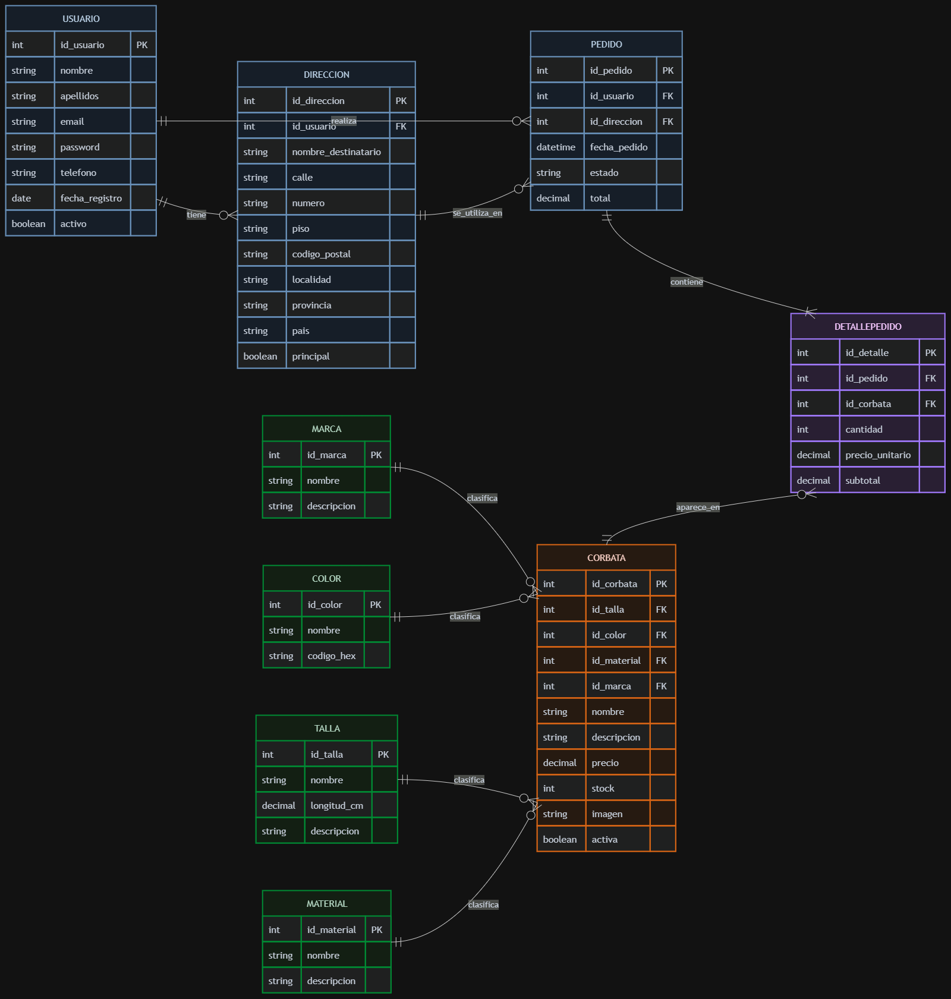

## 11. Modelo relacional

El modelo relacional transforma las entidades del modelo entidad-relación en tablas, definiendo sus campos, claves primarias, claves foráneas y tipos de datos.

### USUARIO

- `id_usuario` INT, clave primaria, autoincremental.
- `nombre` VARCHAR(100), obligatorio.
- `apellidos` VARCHAR(150), obligatorio.
- `email` VARCHAR(150), obligatorio y único.
- `password` VARCHAR(255), obligatorio.
- `telefono` VARCHAR(20), opcional.
- `fecha_registro` DATETIME, obligatorio.
- `activo` BOOLEAN, obligatorio.

### DIRECCION

- `id_direccion` INT, clave primaria, autoincremental.
- `id_usuario` INT, clave foránea hacia `USUARIO`.
- `nombre_destinatario` VARCHAR(150), obligatorio.
- `calle` VARCHAR(150), obligatorio.
- `numero` VARCHAR(20), obligatorio.
- `piso` VARCHAR(50), opcional.
- `codigo_postal` VARCHAR(10), obligatorio.
- `localidad` VARCHAR(100), obligatorio.
- `provincia` VARCHAR(100), obligatorio.
- `pais` VARCHAR(100), obligatorio.
- `principal` BOOLEAN, obligatorio.

### MARCA

- `id_marca` INT, clave primaria, autoincremental.
- `nombre` VARCHAR(100), obligatorio y único.
- `descripcion` TEXT, opcional.

### COLOR

- `id_color` INT, clave primaria, autoincremental.
- `nombre` VARCHAR(50), obligatorio y único.
- `codigo_hex` VARCHAR(7), opcional.

### TALLA

- `id_talla` INT, clave primaria, autoincremental.
- `nombre` VARCHAR(50), obligatorio y único.
- `longitud_cm` DECIMAL(5,2), opcional.
- `descripcion` TEXT, opcional.

### MATERIAL

- `id_material` INT, clave primaria, autoincremental.
- `nombre` VARCHAR(100), obligatorio y único.
- `descripcion` TEXT, opcional.

### CORBATA

- `id_corbata` INT, clave primaria, autoincremental.
- `id_talla` INT, clave foránea hacia `TALLA`.
- `id_color` INT, clave foránea hacia `COLOR`.
- `id_material` INT, clave foránea hacia `MATERIAL`.
- `id_marca` INT, clave foránea hacia `MARCA`.
- `nombre` VARCHAR(150), obligatorio.
- `descripcion` TEXT, opcional.
- `precio` DECIMAL(10,2), obligatorio.
- `stock` INT, obligatorio.
- `imagen` VARCHAR(255), opcional.
- `activa` BOOLEAN, obligatorio.

### PEDIDO

- `id_pedido` INT, clave primaria, autoincremental.
- `id_usuario` INT, clave foránea hacia `USUARIO`.
- `id_direccion` INT, clave foránea hacia `DIRECCION`.
- `fecha_pedido` DATETIME, obligatorio.
- `estado` VARCHAR(50), obligatorio.
- `total` DECIMAL(10,2), obligatorio.

### DETALLE_PEDIDO

- `id_detalle` INT, clave primaria, autoincremental.
- `id_pedido` INT, clave foránea hacia `PEDIDO`.
- `id_corbata` INT, clave foránea hacia `CORBATA`.
- `cantidad` INT, obligatorio.
- `precio_unitario` DECIMAL(10,2), obligatorio.
- `subtotal` DECIMAL(10,2), obligatorio.

### Relaciones del modelo relacional

- `DIRECCION.id_usuario` → `USUARIO.id_usuario`
- `PEDIDO.id_usuario` → `USUARIO.id_usuario`
- `PEDIDO.id_direccion` → `DIRECCION.id_direccion`
- `CORBATA.id_talla` → `TALLA.id_talla`
- `CORBATA.id_color` → `COLOR.id_color`
- `CORBATA.id_material` → `MATERIAL.id_material`
- `CORBATA.id_marca` → `MARCA.id_marca`
- `DETALLE_PEDIDO.id_pedido` → `PEDIDO.id_pedido`
- `DETALLE_PEDIDO.id_corbata` → `CORBATA.id_corbata`

## 12. Entorno de desarrollo con Docker

Para desarrollar el proyecto Tu Corbata se ha preparado un entorno basado en Docker. Esto permite ejecutar los servicios necesarios de forma aislada y reproducible, sin depender de una instalación manual de PHP o MySQL en el equipo.

El entorno está formado por los siguientes servicios:

- PHP 8.3 con Apache, encargado de ejecutar la aplicación web.
- MySQL 8, utilizado para almacenar la base de datos `TIENDA`.
- phpMyAdmin, utilizado para administrar visualmente la base de datos.
- Un volumen persistente para conservar los datos de MySQL.
- Variables de entorno para configurar las credenciales y la conexión.

### 12.1 Estructura del entorno

El archivo `docker-compose.yml` coordina los distintos servicios del proyecto.

La aplicación PHP se comunica con MySQL utilizando el nombre del servicio `mysql` como host interno.

Las credenciales y el nombre de la base de datos se almacenan en un archivo `.env`, que no se incluye en el repositorio por motivos de seguridad.

También se utiliza un archivo `.env.example` como plantilla de configuración.

### 12.2 Puertos utilizados

- Aplicación PHP y Apache: `http://localhost:8080`
- phpMyAdmin: `http://localhost:8081`
- MySQL: puerto `3306`

### 12.3 Persistencia de datos

Se ha configurado un volumen de Docker para conservar la información almacenada en MySQL aunque los contenedores se detengan o se vuelvan a crear.

### 12.4 Comprobación del entorno

Después de iniciar los contenedores, se comprobó:

- El acceso correcto a la aplicación PHP.
- El acceso correcto a phpMyAdmin.
- La creación de la base de datos `TIENDA`.
- La comunicación entre PHP y MySQL.
- La conexión correcta utilizando las variables de entorno.

### 12.5 Evidencia de la conexión

La siguiente captura muestra la aplicación PHP ejecutándose correctamente y confirmando la conexión con la base de datos `TIENDA`.

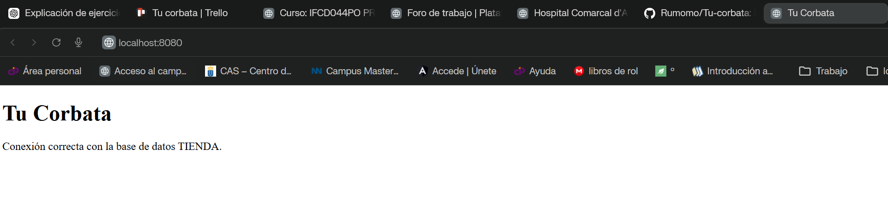
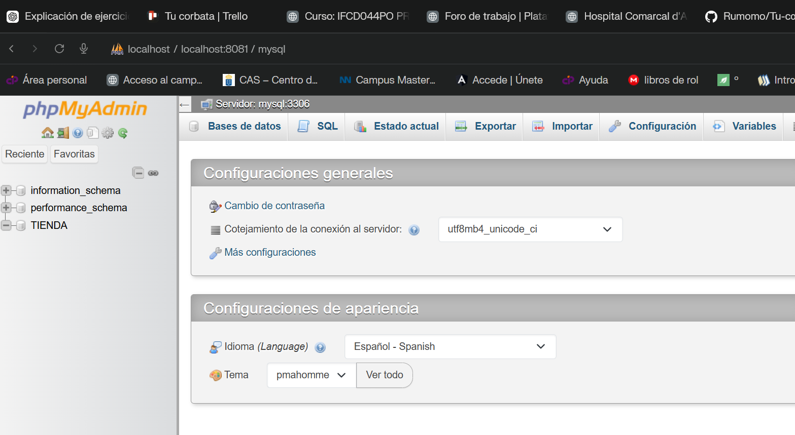

## 13. Creación de las tablas en MySQL

A partir del modelo relacional definido previamente, se han creado las nueve tablas necesarias en la base de datos `TIENDA`.

Las tablas creadas son:

- `usuario`
- `direccion`
- `marca`
- `color`
- `talla`
- `material`
- `corbata`
- `pedido`
- `detalle_pedido`

Cada tabla dispone de sus campos, tipos de datos, clave primaria y restricciones correspondientes.

La siguiente captura muestra las tablas creadas correctamente en phpMyAdmin.

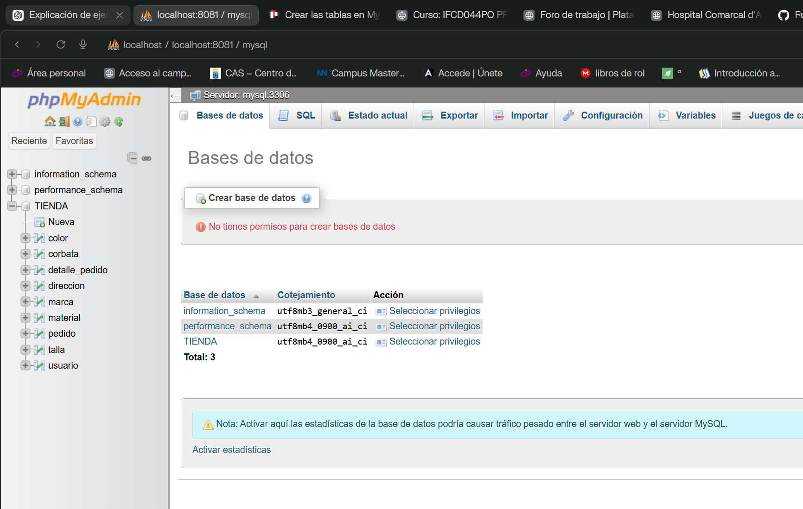

### 13.1 Comprobación de claves y restricciones

Se comprobó que todas las tablas disponen de su clave primaria correspondiente y que las restricciones definidas en el script SQL se crearon correctamente.

Entre las restricciones verificadas se encuentran:

- Valores únicos para correos electrónicos y nombres de clasificación.
- Índice único compuesto en `detalle_pedido`.
- Restricciones `CHECK` para evitar precios, importes o cantidades no válidas.

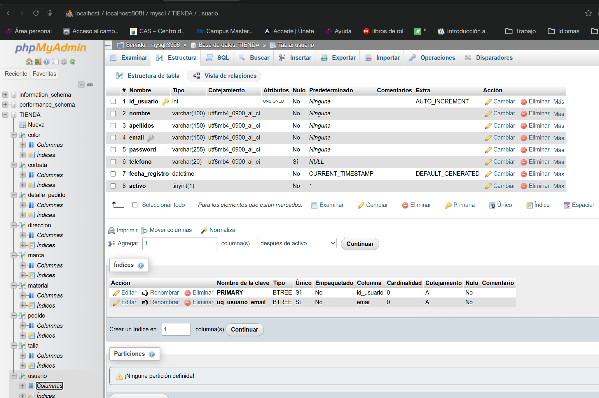

## 14. Relaciones entre las tablas

Después de crear las tablas, se añadieron las claves foráneas necesarias para establecer las relaciones definidas en el modelo entidad-relación y en el modelo relacional.

Las relaciones creadas son:

- `direccion.id_usuario` → `usuario.id_usuario`
- `pedido.id_usuario` → `usuario.id_usuario`
- `pedido.id_direccion` → `direccion.id_direccion`
- `corbata.id_talla` → `talla.id_talla`
- `corbata.id_color` → `color.id_color`
- `corbata.id_material` → `material.id_material`
- `corbata.id_marca` → `marca.id_marca`
- `detalle_pedido.id_pedido` → `pedido.id_pedido`
- `detalle_pedido.id_corbata` → `corbata.id_corbata`

La siguiente captura muestra las nueve claves foráneas creadas correctamente en MySQL.

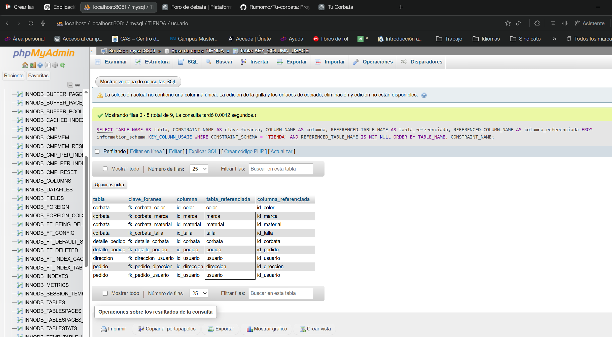

## 15. Inserción de datos de prueba

Para comprobar el funcionamiento de la base de datos, se insertaron registros de prueba en las tablas de marcas, colores, tallas, materiales, usuarios, direcciones, corbatas, pedidos y detalles de pedido.

Los datos se insertaron respetando el orden de las claves foráneas para evitar errores de integridad referencial.

Posteriormente, se realizó una consulta combinando las tablas `corbata`, `talla`, `color`, `material` y `marca`.

La consulta permitió recuperar correctamente:

- El nombre de la corbata.
- El precio.
- El stock disponible.
- La talla.
- El color.
- El material.
- La marca.

## 16. Conexión entre PHP y MySQL

La conexión con la base de datos `TIENDA` se ha implementado mediante PDO.

El código de conexión se encuentra separado del archivo principal de la aplicación en:

`src/config/database.php`

Esta organización permite reutilizar la conexión en diferentes partes del proyecto y facilita el mantenimiento del código.

Las credenciales no se escriben directamente en PHP. La configuración se obtiene mediante las variables de entorno definidas en Docker:

- `DB_HOST`
- `DB_NAME`
- `DB_USER`
- `DB_PASSWORD`

La conexión utiliza el juego de caracteres `utf8mb4` y tiene activado el modo de excepciones para controlar posibles errores.

Se comprobó su funcionamiento desde `index.php`, mostrando el mensaje:

> Conexión correcta con la base de datos TIENDA.

## 17. Consulta de corbatas desde PHP

Se ha creado una consulta en PHP para recuperar las corbatas activas almacenadas en la base de datos `TIENDA`.

La consulta utiliza varias operaciones `INNER JOIN` para obtener también la información relacionada de las tablas:

- `talla`
- `color`
- `material`
- `marca`

El código se encuentra en:

`src/consultas/corbatas.php`

La consulta recupera para cada corbata:

- Identificador.
- Nombre.
- Descripción.
- Precio.
- Stock.
- Imagen.
- Talla.
- Color.
- Material.
- Marca.

La siguiente captura muestra los cinco registros recuperados correctamente desde PHP.

## 18. Visualización de las corbatas

Los datos recuperados desde MySQL se muestran en la página principal mediante tarjetas HTML.

Cada tarjeta presenta:

- Nombre de la corbata.
- Descripción.
- Precio.
- Marca.
- Talla.
- Color.
- Material.
- Stock disponible.

Los datos se recorren mediante una estructura `foreach` y se escapan con `htmlspecialchars` antes de mostrarse en la página.

También se ha incluido control para mostrar un mensaje cuando no existen resultados o cuando se produce un error de conexión o consulta.

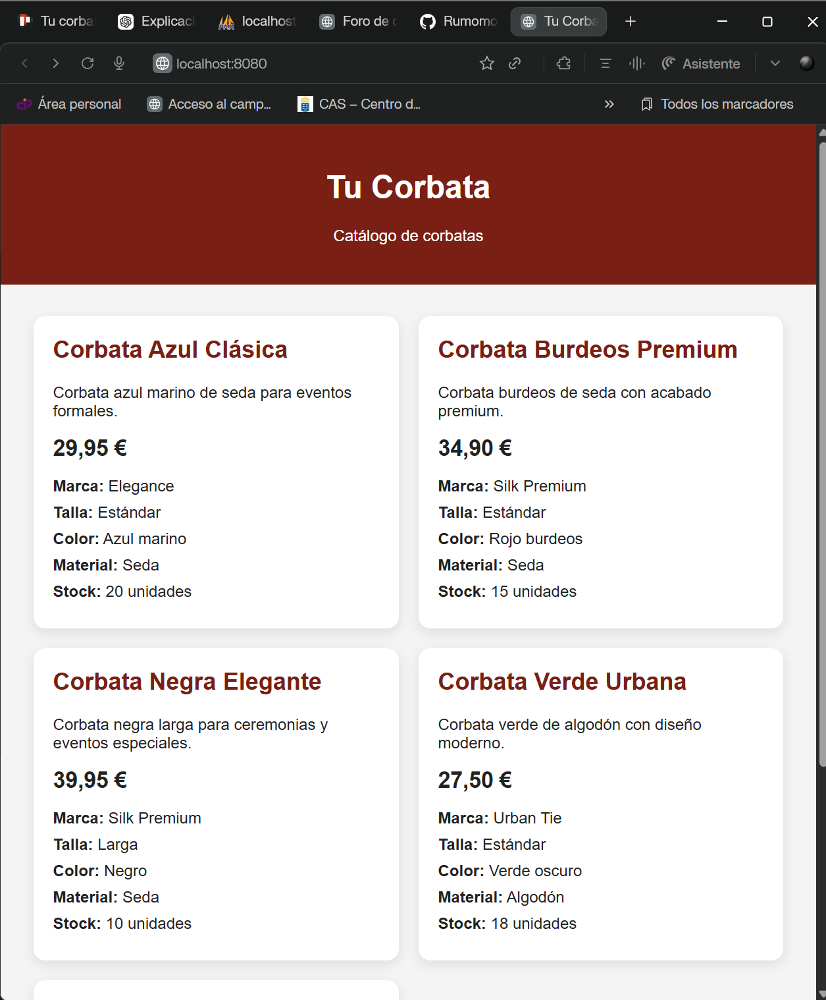

## 19. Pruebas realizadas

Se realizaron distintas pruebas para comprobar el funcionamiento del proyecto y el control de situaciones incorrectas.

### 19.1 Funcionamiento normal

Se comprobó que la aplicación se conecta correctamente con MySQL y recupera las cinco corbatas almacenadas en la base de datos.

También se verificó que las relaciones mediante `INNER JOIN` permiten obtener correctamente la talla, el color, el material y la marca de cada corbata.

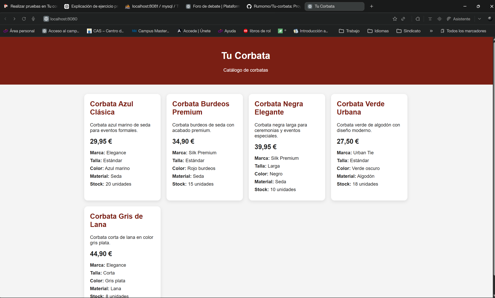

### 19.2 Consulta sin resultados

Se modificó temporalmente la condición de la consulta para que no devolviera ningún registro.

La aplicación mostró correctamente el mensaje:

> No hay corbatas disponibles en este momento.

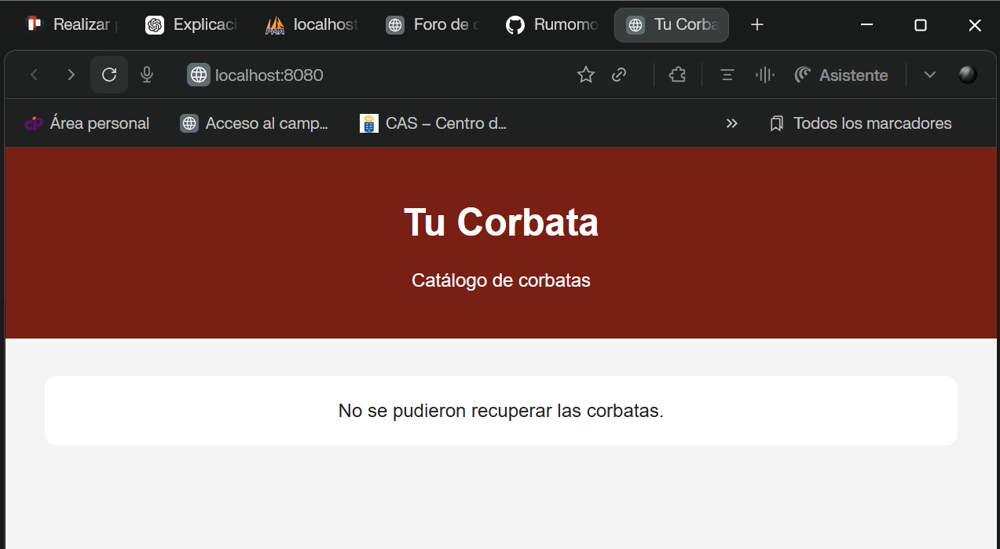

### 19.3 Error de conexión

Se modificó temporalmente el nombre de la base de datos para provocar un error de conexión.

La aplicación controló la excepción y mostró un mensaje genérico sin exponer información sensible:

> No se pudieron recuperar las corbatas.

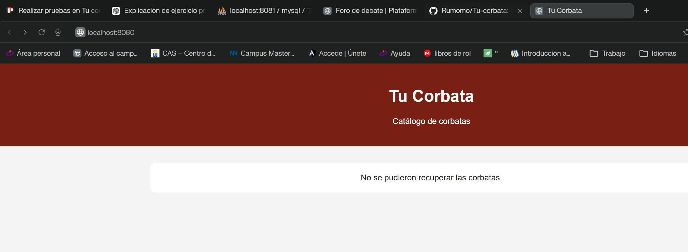

### 19.4 Restricciones de la base de datos

Se intentó insertar una corbata con un precio negativo.

MySQL rechazó la operación debido a la restricción `chk_corbata_precio`, comprobando que las reglas de integridad funcionan correctamente.

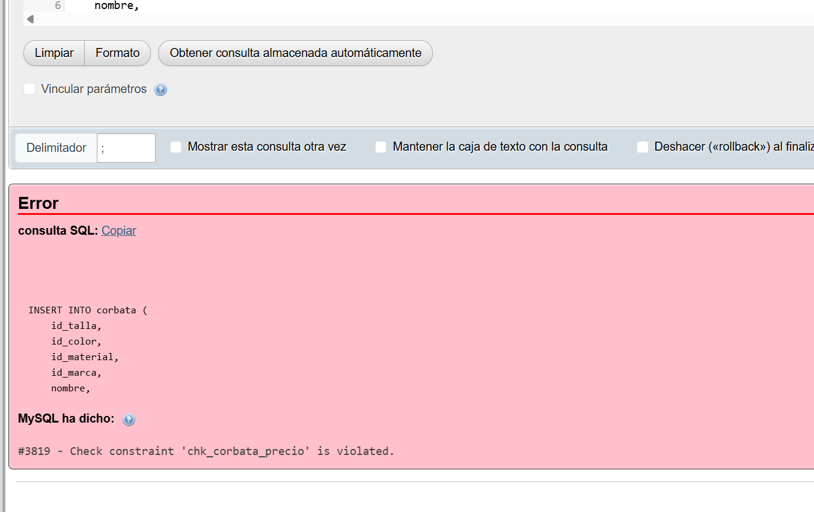

Después de las pruebas, se restauró la configuración original y se comprobó nuevamente que las cinco corbatas se muestran correctamente.

## 20. Tecnologías utilizadas

- PHP
- MySQL
- Docker
- Git
- GitHub
- Trello
- Visual Studio Code 
- PHPMyAdmin

## 21. Planificación del proyecto

El proyecto se organiza mediante un tablero de Trello con las siguientes listas:

- Backlog
- Pendiente
- En proceso
- En revisión
- Finalizado

Esta organización permite controlar el estado de cada tarea y simular un entorno de trabajo real.